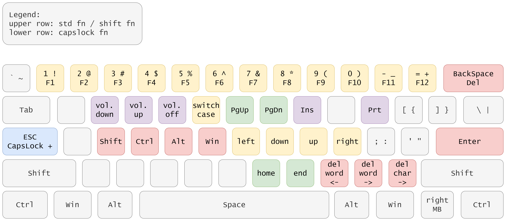

# win-capslock-usefull

This repository provides an [autohotkey](https://www.autohotkey.com/) script, which utilizes
the `capslock` as a modifier key.

## Why?

Because a need to switch case:

- is quite rare,
- may be sutisfied by an IDE function,

and the CapsLock occupies a golden position on a keyboard. Therefore, it makes sence to use it for
other purposes.

Also, if you have a minimalistic keyboard, without keys and home/end block, it is a neccesity to
have another modifier.

## What this script does?

Summary of modified keyboard shortcuts:

```text
Ctrl + CapsLock     => CapsLock ( switch case )
CapsLock ( + None ) => Esc
CapsLock + h/j/k/l  => arrows left/down/up/right, including some combos:
                       - CapsLock + Shift
                       - CapsLock + Shift + Alt
                       - CapsLock + Shift + Ctrl (eg. multiline cursor in vscode)
                       - CapsLock + Shift + Ctrl + Alt (eg. column (box) selection in vscode)
                       - CapsLock + Ctrl
                       - CapsLock + Ctrl + Win (switching desktops in Windows)
                       - CapsLock + Alt
                       - CapsLock + Win (moving windows in Windows)
CaspLock + n/m      => Home/End
CaspLock + y/u      => PageUp/PageDown
CaspLock + </>/?    => Delete word-before/word-after/char-after/
CapsLock + i/p      => Insert/PrintScreen
CapsLock + 1/../0/= => F1/../F10/F12  (F11 TO-DO)
CapsLock + w/e/r    => volume down/up/off
```

Visualisation is better, right?


## How to use this script?

Install the autohotkey. [Official docs](https://www.autohotkey.com/docs/Tutorial.htm#s11).

Chocolatey:

```powershell
choco install autohotkey
```

Then simply run the script from where ever you have it. It is also possible to start the script
with Windows logon via `Task Scheduler`.

## License

License is MIT.
